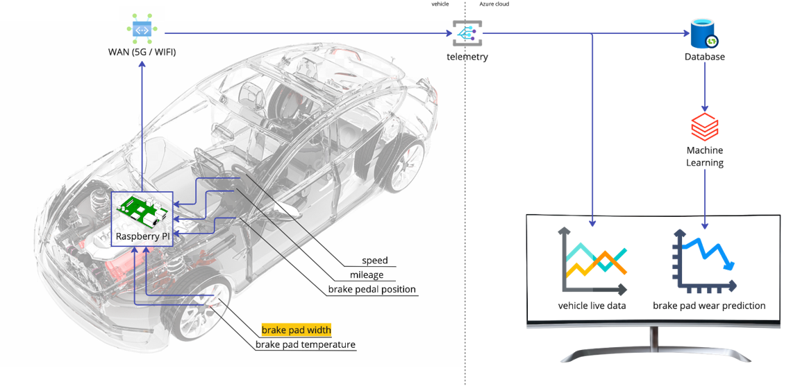
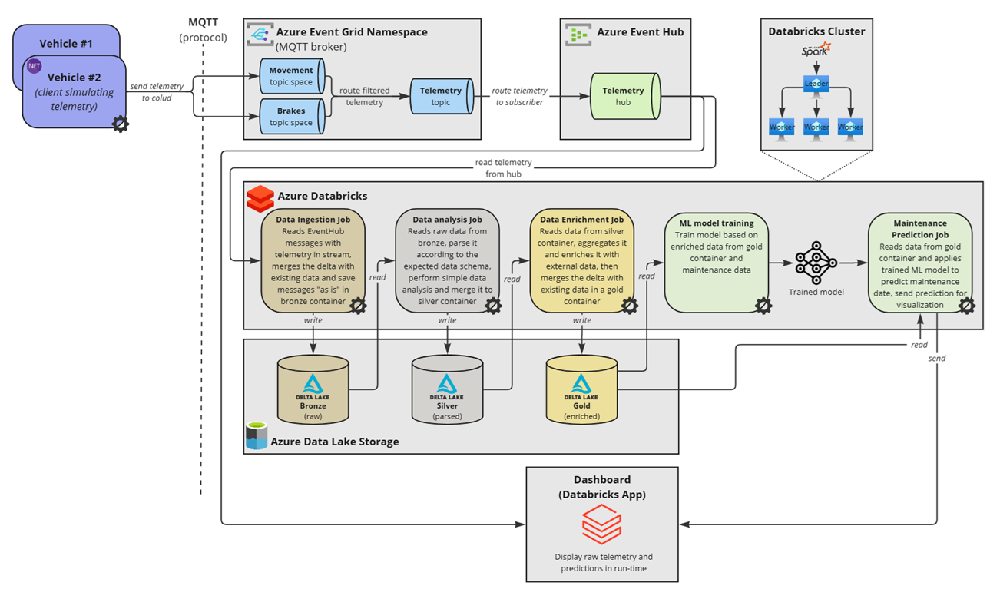

# Predictive maintenance in automotive: brake pads case
## Introduction
This proof of concept demonstrates how predictive maintenance can be implemented for vehicle fleets in the automotive industry. It helps to enhance vehicle safety and reduce downtime through real-time telemetry, advanced analytics, and machine learning. In this showcase we selected brake pads as vehicle parts to build prediction of their wear based on driving behavior. However, the applied approach and architecture also allow to build prediction for other vehicle maintenance activities, such as tire replacement, fluids checks etc.

We are utilizing [Microsoft Reference Architecture for SDV](https://learn.microsoft.com/en-us/azure/event-grid/mqtt-automotive-connectivity-and-data-solution) and integrating Eclipse Foundation projects, implementing both off-vehicle and in-vehicle components. Our solution leverages technologies based on open standards, such as [COVESA Vehicle Signal Specification (VSS)](https://github.com/COVESA/vehicle_signal_specification), [Eclipse KUKSA](https://github.com/eclipse-kuksa) to seamlessly connect fleet data to the cloud, optimizing the predictive maintenance process across entire fleets.

## Concept
The solution operates as a data-driven pipeline for real-time predictive maintenance. Telemetry data is continuously streamed from vehicles to the cloud, where it is processed, enriched, and used to train a machine learning model that estimates brake pad wear based on driving behavior. Once trained, the model runs inference on incoming data in real time. Both raw telemetry and wear predictions are displayed through a live dashboard, enabling continuous monitoring of vehicle condition.

The following schematic diagram provides a high level overview of the solution.

Implementation consists of the following main parts:
- Software/hardware for simulating real-time data from vehicle sensors
- Software for collecting and processing vehicle data
- ML model for predicting the brake pads wear
- Dashboard showing vehicle live data as well as the brake pads wear prediction

### In a vehicle
In the current implementation, there are three supported ways to simulate real-time vehicle telemetry:
1. **Use the VehicleSimulator .NET console application included in the solution.**
   
   It can simulate vehicle driving and send specified telemetry parameters to the cloud. You can configure coefficients, minimum and maximum values to simulate different driving behaviors. This is the easiest and fastest way to simulate vehicle telemetry.
   
2. **Use the [Euro Truck Simulator 2](https://eurotrucksimulator2.com/) video game.**
   
   We have included a custom module in the solution that can be embedded into the game. This module automatically sends telemetry data from the game to the cloud during truck driving.
   
   **Note:** *Euro Truck Simulator 2 is not included in the solution and must be installed separately.*
   
3. **Use a specially developed hardware stand.**
   
   The stand replicates part of a real car, including an electric motor and sensors. It allows a person to sit in the driver's seat, turn the steering wheel, and press the brake or accelerator pedals. Telemetry from the stand is transmitted to the cloud in real time.

(~~Ask Sergey for clarifications and additional information about hardware stand and how we use KUKSA~~)

### Off a vehicle
The schema below illustrates the complete off-vehicle flow, starting from receiving telemetry in the cloud and ending with applying a trained ML model to predict brake wear, as well as displaying real-time vehicle data and predictions on the dashboard. We have adapted [Microsoft Reference Architecture for SDV](https://learn.microsoft.com/en-us/azure/event-grid/mqtt-automotive-connectivity-and-data-solution) to meet the needs of this proof of concept.

The vehicle publishes telemetry and events messages through a Message Queuing Telemetry Transport (MQTT) client with defined topics to the Azure Event Grid’s MQTT broker feature

The Event Grid can route messages to different subscribers based on the topic and message attributes.
Low priority messages that don't require immediate processing (for example, analytics messages) are routed directly to storage using an Event Hubs instance for buffering.

### Dashboard

